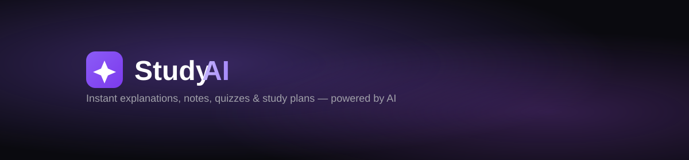

<p align="center">
  <a href="https://ai-study-assistant-kohl-eight.vercel.app">
    
  </a>
</p>

<p align="center">
  <a href="https://ai-study-assistant-kohl-eight.vercel.app"></a>
</p>

<p align="center">
  
  
  
  
  
  
  
  
</p>

A full-stack AI-powered study assistant. Enter any topic and get instant explanations, concise study notes, auto-generated quizzes, and a personalized study plan — tailored to your chosen difficulty level.

**🔗 Live Demo:** [ai-study-assistant-kohl-eight.vercel.app](https://ai-study-assistant-kohl-eight.vercel.app)

---

## ✨ Features

- User registration and login (credentials-based auth via NextAuth)
- Google and GitHub OAuth sign-in with secure account linking
- AI-powered topic explanations
- Auto-generated study notes (markdown-formatted)
- Auto-generated multiple-choice quizzes with instant grading and explanations
- Personalized study plans saved to the database
- Difficulty selection: Beginner / Intermediate / Advanced
- Chat/session history and generated notes/quizzes/plans persisted per user
- Loading and error states throughout
- Responsive, clean UI (Tailwind CSS)

## 🛠️ Tech Stack

| Layer | Technology |
|---|---|
| Framework | Next.js 16 (App Router, TypeScript) |
| Styling | Tailwind CSS |
| Database | PostgreSQL via [Neon](https://neon.tech) (free tier) |
| ORM | Prisma |
| Auth | NextAuth v5 — credentials, Google OAuth, GitHub OAuth, bcrypt hashing |
| AI | [Groq](https://groq.com) API (fast LLM inference) |
| Hosting | Vercel (single deployment, frontend + API routes) |

## 📂 Project Structure

```
ai-study-assistant/
├── app/
│   ├── api/
│   │   ├── auth/[...nextauth]/   ← NextAuth handler
│   │   ├── signup/                ← Registration endpoint
│   │   └── study/
│   │       ├── explain/           ← Topic explanation generation
│   │       ├── notes/             ← Study notes generation
│   │       ├── quiz/              ← Quiz generation
│   │       └── plan/              ← Study plan generation
│   ├── login/
│   ├── signup/
│   ├── dashboard/                 ← Past notes/quizzes overview
│   └── study/                     ← Main study assistant UI
├── lib/
│   ├── prisma.ts                  ← Prisma client singleton
│   └── groq.ts                    ← Groq API wrapper + prompt logic
├── prisma/
│   └── schema.prisma               ← Database schema
├── auth.ts                        ← NextAuth configuration
└── types/next-auth.d.ts           ← Session type augmentation
```

## ⚙️ Setup

### 1. Clone and install

```bash
git clone https://github.com/keerthana911-netizen/ai-study-assistant.git
cd ai-study-assistant
npm install
```

### 2. Set up a free PostgreSQL database

1. Go to [neon.tech](https://neon.tech), sign up, create a project
2. Copy the connection string it gives you

### 3. Get a free Groq API key

1. Go to [console.groq.com/keys](https://console.groq.com/keys)
2. Create an API key

### 4. Configure environment variables

Copy `.env.example` to `.env` and fill in:

```
DATABASE_URL="your-neon-connection-string"
NEXTAUTH_SECRET="run: npx auth secret"
NEXTAUTH_URL="http://localhost:3000"
GROQ_API_KEY="your-groq-api-key"
GROQ_MODEL="openai/gpt-oss-20b"
GOOGLE_CLIENT_ID="your-google-client-id"
GOOGLE_CLIENT_SECRET="your-google-client-secret"
```

For local Google OAuth, use `http://localhost:3000/api/auth/callback/google` as the callback URL. For production, use `https://ai-study-assistant-kohl-eight.vercel.app/api/auth/callback/google`.

Public legal pages are available at `/privacy` and `/terms`.

### 5. Set up the database

```bash
npm run db:generate
npx prisma migrate dev --name init
```

If you already initialized the database before the StudyPlan model was added, run `npx prisma migrate dev --name add-study-plans` (or `npm run db:push` for a quick demo database update).

### 6. Run it

```bash
npm run dev
```

Visit `http://localhost:3000`.

### Useful checks

```bash
npm run lint
npm run build
npx prisma studio
```

## 🚀 Deployment

Deployed on Vercel — single deployment for both frontend and API routes, no separate backend needed.

1. Push to GitHub
2. Import the repo on [vercel.com](https://vercel.com)
3. Add the same environment variables in Vercel's project settings
4. Deploy — Vercel runs `prisma generate` automatically via the build step

**🔗 Live Demo:** [ai-study-assistant-kohl-eight.vercel.app](https://ai-study-assistant-kohl-eight.vercel.app)

**60-second demo flow:** create an account (or use Google), explain a topic, generate notes, complete a quiz, generate a study plan, and open the dashboard to show the saved history.

## ⚠️ Known Limitations

- Groq's available free-tier models change over time — if generation stops working, check [console.groq.com/docs/models](https://console.groq.com/docs/models) and update the model string in `lib/groq.ts`
- No rate limiting on API routes
- Quiz JSON parsing assumes the LLM returns well-formed JSON; malformed responses will surface as a generation error rather than silently failing

## 🎯 Learning Outcomes

- Building a unified full-stack app with Next.js API routes (no separate backend server)
- Type-safe database access and schema modeling with Prisma
- Implementing authentication from scratch with NextAuth credentials provider
- Prompt engineering for structured (JSON) LLM output vs. free-form text output
- Designing a relational schema for a real multi-user application (Users → Sessions → Messages/Notes/Quizzes/Plans)

## 👩‍💻 Author

**Keerthana** — B.Tech CSE, SRM Institute of Science and Technology
